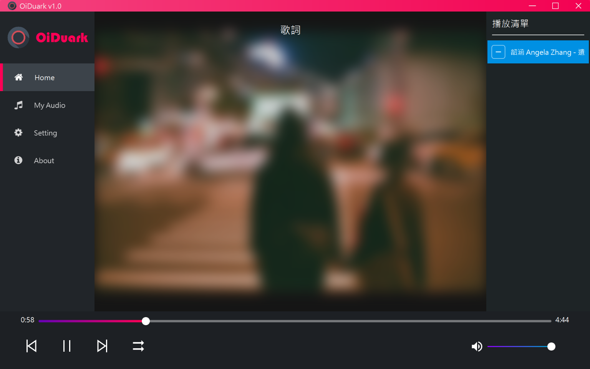
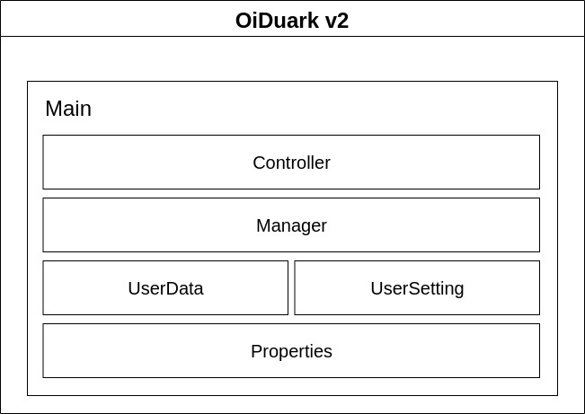

# OiDuark

## Architecture

## Description
*With this audio manager, you can manage your audio by attaching tags on them. Then you would be able to act with the specified tags.*

## Features
* Playing the audio list
* Attaching tags on your audio
* Add/Rename/Delete your audio
* Putting the audio with the specified tags into play list

## Environment
* Windows 10 / Windows 11 / Linux
* Java 8 runtime environment with JavaFX

## Usage

Download the latest released JAR at the right side.  

Check if your environment satisfies. And then just double click the JAR file to execute this app.

## TO-DO
- [x] create userdata inside user's local appdata
- [ ] more customizable appearance
- [ ] upgrade to java 17
