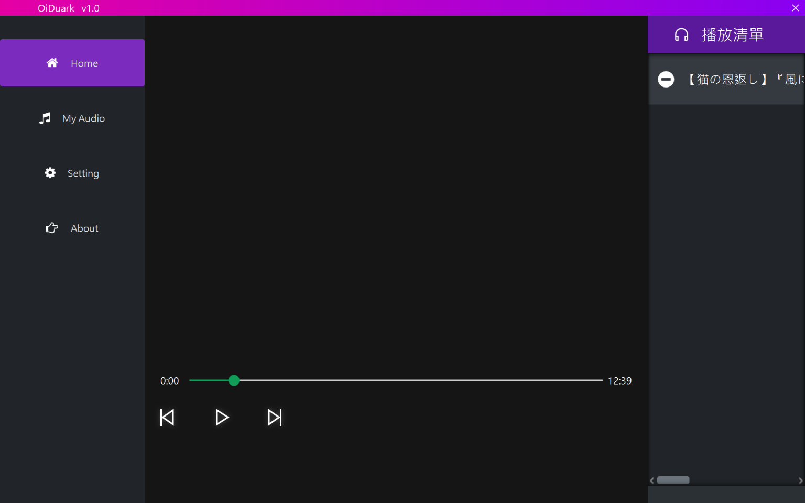
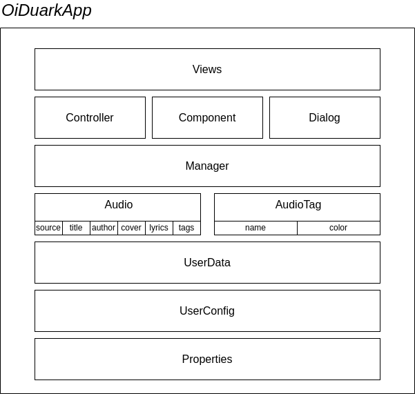

# OiDuark

> Whenever you want to enjoy musics or songs with specific styles, you won't need to add them into a new play list anymore. Just use **Tag Filter** 😍.



## Architecture 🔧



## Description 📋
This is a music player desktop application developed by JavaFX.  

With this application, you can enjoy the downloaded musics or songs anytime. You won't need to manually add them into a new play list anymore. Just use the tag filter.

## Features 🤩
* Editing musics/songs title, author, tags, ...etc
* Customizing tags name and color
* Adding your favorite musics/songs
* Searching audio by keywords and tags
* Playing a queue of musics/songs
* Will not litter your user home(either `~` in linux or `C:/Users/${your username}` in windows).
* Choose your own media storage and userdata storage path.

## Requirements 💻
* Windows 10 / Windows 11 / Linux
* Java 11+

## Usage 🧭

Please check if your environment satisfies the requirements.

### Linux

Download the latest released `tar.gz` file. And then extract them by executing the command: 

```sh
tar -xvf oiduark-0.0.1-SNAPSHOT.tar.gz
```

Note that the binary file is stored in `bin/`. Launch OiDuark by this command:

```sh
cd oiduark-0.0.1-SNAPSHOT/bin/
chmod u+x oiduark-launcher
./oiduark-launcher
```

Or you can just double-click the `oiduark-launcher` under `bin/`.

### Windows

Download the latest released `zip` file and extract them.  
Then Launch OiDuark by this command:

```bat
cd oiduark-0.0.1-SNAPSHOT/
.\oiduark-launcher
```
Or you can just double-click the `oiduark-launcher.bat`.

## TO-DO 🎯

- [x] create userdata inside user's local appdata
- [x] upgrade to java 18
- [ ] lyrics display
- [ ] AI auto tagging
- [ ] browsing musics and songs & downloading
- [ ] more customizable appearance
