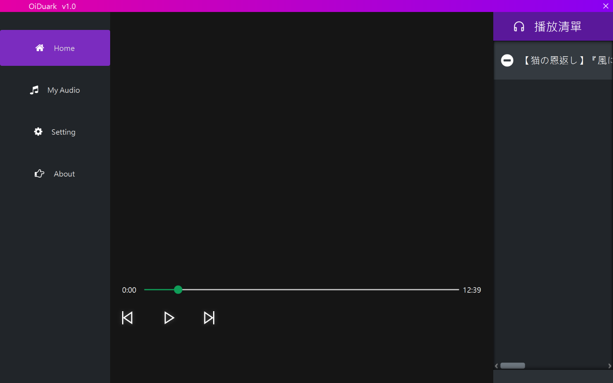

# OiDuark

## Description
*With this audio manager, you can manage your audio by attaching tags on them. Then you would be able to act with the specified tags.*

## Features
* Playing the audio list
* Attaching tags on your audio
* Add/Rename/Delete your audio
* Putting the audio with the specified tags into play list

## Environment
* Windows 10
* Java 8 runtime environment
