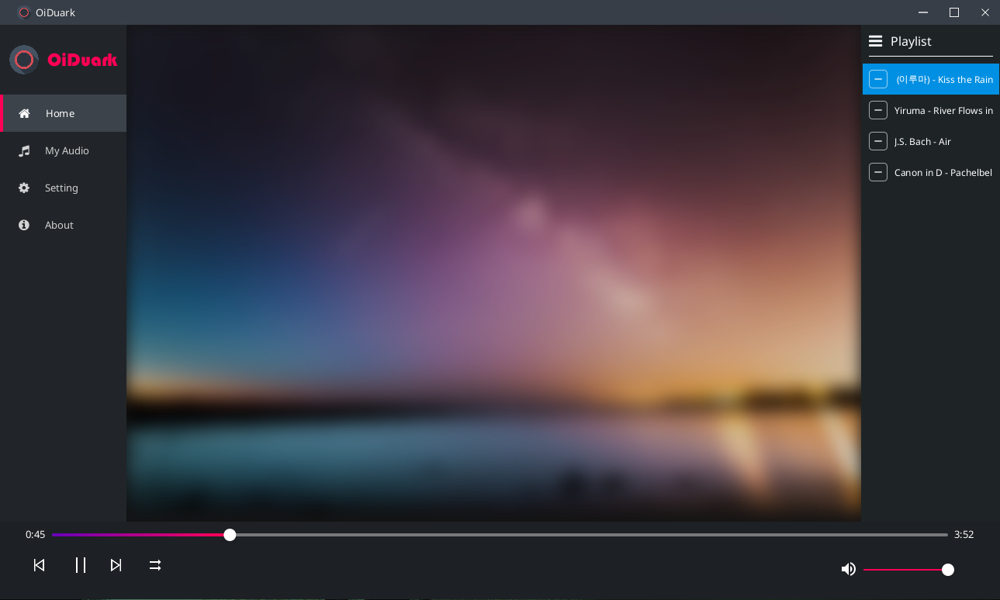

# OiDuark

> Whenever you want to enjoy musics or songs with specific styles, you won't need to add them into a new play list anymore. Just use **Tag Filter** 😍.  



## Architecture 🔧


## Description 📋
This is a music player desktop application developed by JavaFX.  

With this application, you can enjoy the downloaded musics or songs anytime. You won't need to manually add them into a new play list anymore. Just use the tag filter.

## Features 🤩
* Editing musics/songs title, author, tags, ...etc
* Customizing tags name and color
* Adding your favorite musics/songs
* Searching audio by keywords and tags
* Playing a queue of musics/songs
* Will not litter your user home(either `~` in linux or `C:/Users/${your username}` in windows).
* Choose your own media storage and userdata storage path.

## Requirements 💻
* Windows 10 / Windows 11 / Linux
* Java 11+ (Optional)

## Usage 🧭

Please check if your environment satisfies the requirements.  

Note that if you download the binary release from [the github releases page](https://github.com/SharpKoi/OiDuark/releases), it includes the java runtime, which is the supported version. So you won't need to install java runtime on your environment.

### Generic

Download the latest released `tar.gz`(for Linux) /`zip`(for Windows) file. Extract the files and use the commands below to launch OiDuark:

```bash
cd oiduark-0.0.3-SNAPSHOT/bin
./java -jar oiduark.jar
```

**Note:** You may need to specify the GTK version to support input methods other than English if you're using Linux with GTK2+ installed. Here's an example:

```bash
./java -Djdk.gtk.version=2 -jar oiduark.jar
```

### Linux

Download the latest released `tar.gz` file. And then extract them by executing the command: 

```sh
tar -xvf oiduark-0.0.3-SNAPSHOT.tar.gz
```

And use the command below to install OiDuark:

```sh
sh oiduark-0.0.3-SNAPSHOT/install.sh
```

It will create a desktop application so you can find it in the application menu.

### Windows

The instruction is waiting for update. Use [Generic](#Generic) instruction instead.

## TO-DO 🎯

- [x] create userdata inside user's local appdata
- [x] upgrade to java 17
- [ ] lyrics display
- [ ] browsing musics and songs & downloading
- [ ] more customizable appearance
